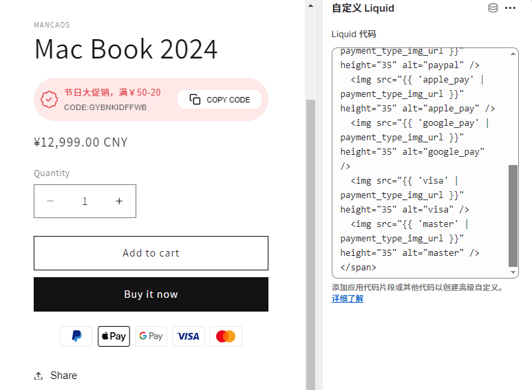
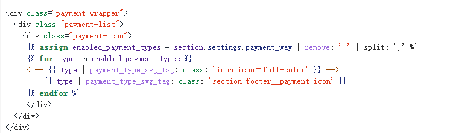
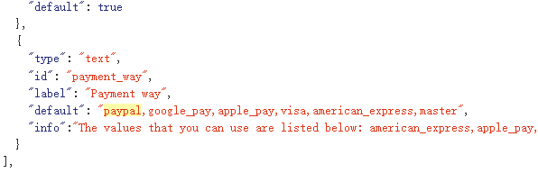
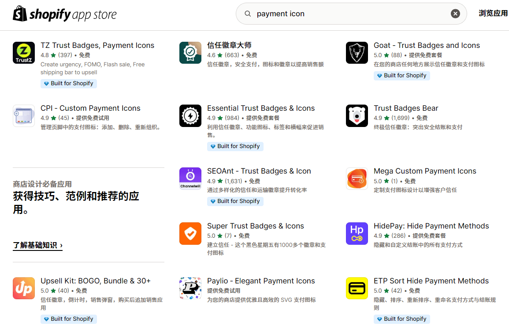
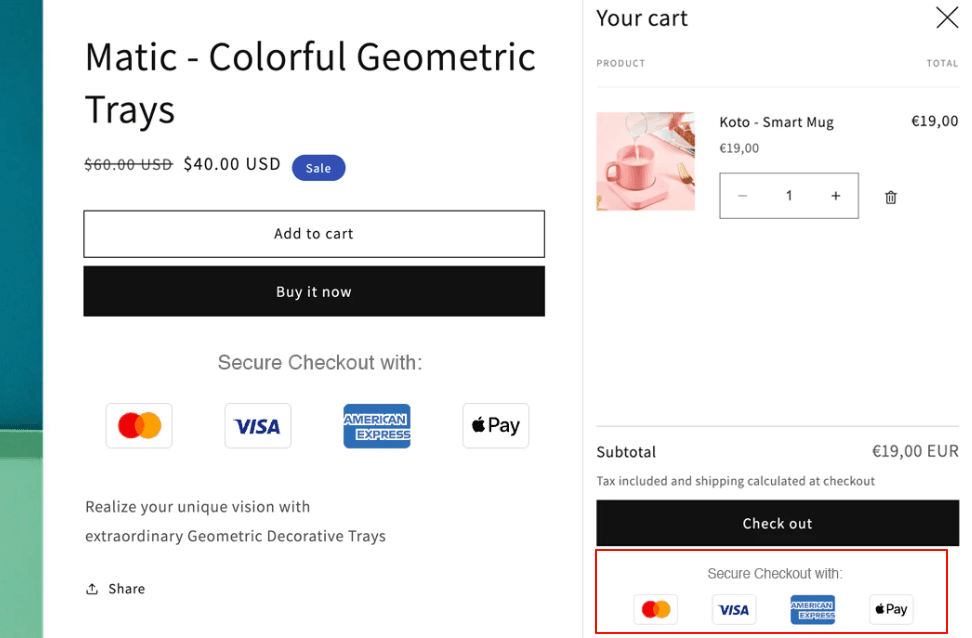

import Alert from '@/components/Alert.astro'


### 为什么无法在产品页和网站页尾展示付款图标？

<Alert variant="tip" title="注意">Shopify 现已支持所有商店显示付款图标，现在所有模板都会根据商家使用的收款提供商显示支持的付款图标。但如果你想指定显示哪些付款图标，仍可以参考本文章，因为Shopify 会显示所有付款图标，这会导致网站排版看起来更乱。</Alert>

通常情况下，shopify模板都具有展示付款图标的选项功能，你只需要在产品模板中开启显示即可，但是只有开通Shopify payments的商家才能正常使用这个功能。


在Shopify商店中展示付款图标的3种方式:

## 1.最简单的方式：使用Liquid代码

复制以下代码，在产品模板页面中点击”添加 Block块”，找到并添加一个 "custom liquid（自定义Liquid）" 区块，把代码复制进去即可

``` html
<style>
  .methods-of-payment {
    display: flex;
    justify-content: center;
    align-items: center;
    flex-wrap: wrap;
    margin-top: 10px;
  }

  .methods-of-payment img {
    height: 25px; /* 图标高度 */
    margin: 0 5px; /* 图标之间的间距 */
  }

  .lt-ie9 .methods-of-payment,
  .ie8 .methods-of-payment,
  .oldie .methods-of-payment {
    display: none;
  }
</style>


  在下方assign payment_types中填写你想要自定义的付款方式名称即可。本提示不会在网站上显示。



<span class="methods-of-payment">
  
    
  
</span>
```

**效果预览：**



你可以在 `assign payment_types=" " `中填写想要显示的付款方式，shopify支持以下付款方式图标：

```
afterpay - american_express - apple_pay - bitcoin - dankort - diners_club - discover - dogecoin - dwolla - facebook_pay -forbrugsforeningen - google_pay - ideal - jcb - klarna - klarna-pay-later - litecoin - maestro - master - paypal - shopify_pay - sofort - unionpay - visa
```

通过在产品页面显示你的网站支持的付款方式，有助于提升客户信任。

**提升转化率的技巧**：如果你的商店支持分期付款，先买后付等付款方式，可以把 Klarna，shopify_pay 等显示在靠前的位置，这对于高客单价产品较为有效。

## 2.修改主题模板代码

此种方式需要您具有前端和Liquid基础技术。

shopify主题模板一般支持在两个地方显示付款图标：**产品页面和页尾**

我们可以通过添加Liquid代码来实现这个功能，对于不同主题由于其功能结构的不同修改的文件也不同，通常修改 _main-product.iquid_ 和 _footer.liquid_ 即可实现





## 3.使用shopify app store中的付费插件

在app商店中有许多信任徽章应用，搜索相关关键词例如 “payment icon” 就可以找到，一些插件也提供免费套餐



## 一种更好的方法：在购物车中显示付款和物流图标

多数付费shopify主题都支持动态弹出式购物车，我们可以在购物车底部添加，这样用户在加购后就能看到它们。如果需要开发此功能，一般需要修改 _cart-drawer.liquid_ 文件.


