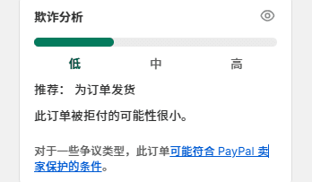
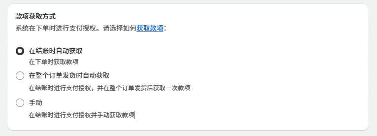
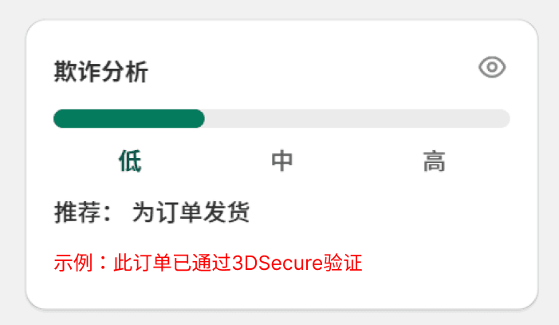

## 💳什么是信用卡拒付与拒绝？

很多人刚开始往往分不清**拒付**（charge back）与**拒绝**（decline）。

**拒付**（charge back）是指客户认为在这笔交易中他遭遇了欺诈，他的信用卡被人盗用或商家没有交付产品以及可能交付了质量不合规的产品，因此客户向银行发起拒付，请求银行将钱款追回。拒付主要有以下类型：

- **欺诈：客户认为在这笔交易中他遭遇了欺诈**，**他的卡被盗刷**。**这是商家最经常面临的拒付类型，本篇文章的主旨就是如何避免欺诈性拒付，本文提到的拒付特指欺诈拒付**

- 未收到产品

- 产品不可接受

- 信用额度未处理

- ....

**拒绝**（decline）是指客户在购物过程中因余额不足，交易面临风险等因素导致无法完成付款，银行最终拒绝了购物交易，这不会对商家造成任何风险。

信用卡拒付会导致商家钱货两空，还会被要求支付争议处理费甚至面临卡组织的罚款，可谓损了夫人又折兵，只能忍气吞声咽下损失，因为信用卡组织往往无条件偏向客户，即使客户使用了**友好型欺诈方式**（意思是卡是客户的，商家也履行了交付义务，而客户却撒谎称遭遇了欺诈的薅羊毛行为）

需要注意的是，如果商家交付的产品和服务确实存在问题，应积极面对客户的合理诉求，如果商家在短时间内遭遇了多笔拒付，可能遭到银行和卡组织的审查与罚款。

## 🛡️了解 shopify 欺诈分析系统

Shopify 与 stripe 合作的欺诈分析系统可以最大程度帮助商家避免被客户欺诈，信用卡拒付欺诈往往是有组织有预谋的，商家不应贪图销售额而在面临高风险的情况下为欺诈订单发货。

你可以在每一笔订单右下方看到欺诈分析指标，欺诈风险分析有三个指标：

高风险：欺诈订单，请取消该订单

中风险：通常情况下不是欺诈订单，不会出现拒付

低风险：正常订单

点击小眼睛图标可以看到详细的分析指标。

欺诈分析系统会对每一笔订单生成风险指标，即使这个订单是使用 paypal 等非信用卡付款方式支付的。

**欺诈分析系统并不是完全免费的**，只有商家满足以下条件之一，才会看到订单欺诈分析指标：

- 商家开通了 shopifyPayments 收单方式，将自动获取欺诈分析

- 商家使用 shopify basic 以上的套餐，将免费获取欺诈分析

使用最便宜的 Basic套餐则无法在shopify后台看到欺诈分析，但是你的收单服务商后台会提供免费的欺诈分析功能，具体可以咨询收单方。

## ⚠️避免欺诈的最佳做法：自动拒绝为高风险订单发货

如果某笔订单被标记为高风险，即使客户证明他是卡持有人或提交了证明交易合法的其他资料，也要拒绝为这笔订单发货，99% 的高风险订单最终都会出现信用卡拒付。出现高风险订单后，需要立即取消该订单并退款。商家应该信任欺诈分析系统，这是基于多年的海量交易数据和机器学习做出的预警。

如果订单被标记为中风险，通常情况下可以为订单发货，这类订单很少出现拒付，如果交易额较大，商家也可以与客户先沟通再发货。

如果订单为低风险，则没有遭遇欺诈性拒付的风险

### 使用 shopify flow 自动化取消高风险订单
每次手动取消高风险订单都很麻烦，你可以打开后台的 flow 应用，点击**浏览模版**，找到“Cancel high-risk orders”，安装并启用，如果商店出现高风险订单，flow 会在高风险订单被创建后立即自动取消该订单，并向你发送一封邮件通知此次交易的信息。

## 减少损失：调整款项获取方式

对于高客单价的商店来说，每笔订单可能高达数千美元，当一笔订单发生取消或退款时，银行并不会退还交易时收取的手续费，以常规4%的卡费率举例，当一笔订单1000美元的高风险订单被取消并退款后，你仍然会被收取40美元的手续费。

**为减少损失，商家可以调整款项获取方式**，如果商家在取消订单前没有获取款项，则这笔交易额处于pending状态，并未打入商家收款帐户。当一笔订单被创建后，商家可以选择多种款项获取方式来收取订单交易额到收款账户中：

- 立即获取款项：客户下单后就立即自动获取款项，这意味着取消订单也会被收取手续费

- 发货时自动获取：为某个订单完整发货后（只有在订单中点击**为商品发货**后才算发货）自动获取

- 手动获取：在每笔订单中点击“获取款项”时才会获取

**建议：**如果你的商店订单取消率高，高风险订单多，建议使用**发货时自动获取**的方式。

这样在取消订单或高风险订单时就不会被收取手续费，因为此时订单款项正处于pending状态，还未打入你的收款账户中。

**需要注意**：如果你的商店发货周期较长，总是很久才能发货，要及时手动获取款项（使用发货时自动获取方式时也可以提前手动获取），因为在订单被创建后一周左右商家如果没有获得款项，钱款将会原路退回客户手中。

## 遭遇拒付后应该怎么做

如果某笔订单出现拒付，**钱款会被立即追回**，你的收单方（shopifyPayments,airwallex，万里汇，payoneer等）会通知你处理拒付，通常你需要在一个月内提交证据进行申诉，每次拒付银行都会收取一笔拒付处理费（十几美元左右），如果是高风险订单出现欺诈性拒付，就不要抱有追回钱款和货物的希望了，通常银行都会判定客户胜利，**请记住预防欺诈是商家在信用卡网络中的一份责任，不为高风险订单发货既可以保护你自己也可以保护真正的卡主人**。

如果是因客户对商品和服务不满意导致的拒付，则可以尝试和客户沟通，补偿客户能否去银行撤销拒付，当然你也可以提交证据等待银行裁定。

拒付争议的胜利一方将会获取交易款项，如果商家胜利，则可能还将获得拒付处理费。

对于任何一笔订单，客户通常可以在120天到半年的时间内发起拒付。

## 独立站拒付订单过多怎么办

对于处于信用卡交易网络中的商家来说，需要尽最大力度减少订单拒付，如果商店在某一时间段内的拒付订单较多，会面临多重风险：

- 收单服务提供商如 Shopify payment、Stripe、Airwallex 等可能会关停你的账户，无法收款。
- paypal 会提高你的争议处理费
- Shopify 将关停你的 shop 店铺

因此商家提供的商品和服务要保证基本质量，在处理和客户的纠纷中坦诚相对，如果商家问题较大，尽量多补偿客户，让客户取消争议。

## 3DS验证与责任转移

最后说说3DS验证与责任转移，3D Secure验证是保障交易合法的一种身份验证技术，当客户下单付款时，交易系统可能会启动3DS验证来确认这次交易是否有风险，这会要求客户使用以下方式来验证身份：

- Pin码

- 验证码或密码 （查询码）

- 指纹或其他生物识别方式

3DS验证是由收单方自动设置的，例如shopifyPayments 或空中云汇，Stripe等，3DS验证过的交易更加安全，但如果验证频率过高也会导致客户弃单，转化率下降。一些收单方允许客户指定如何设置3DS验证。

**责任转移** ：如果一笔订单触发并通过了3DS认证，则会在shopify风险分析指标中显示。通过3DS验证的订单责任将被转移到发卡方，简而言之：如果这笔订单以后出现拒付争议，则商家不应为此负责，因为商家是收款方银行的客户，不是发卡银行的客户。此时你的收单服务商将负责为你处理这笔拒付交易，而不是由客户的银行裁判。

**Shop Protect** ：如果你使用 shopifyPayments，则在部分地区如美国支持 Shop Protect，通过Shop Protect 验证的订单即使遭遇欺诈，损失会由 Shopify 赔付。

